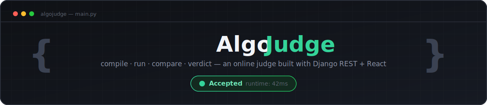
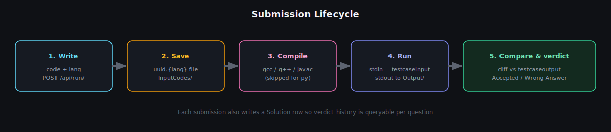
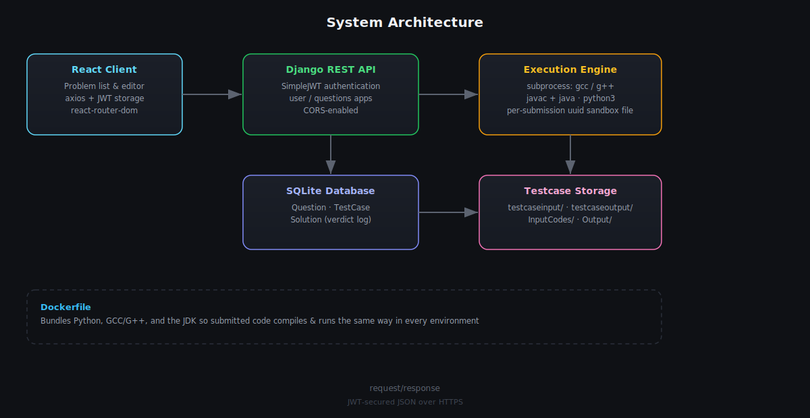

<div align="center">



<br/>

[](https://algojudge.vercel.app)


**A LeetCode-style online judge — write code, hit run, get a verdict.**

</div>

<br/>

## What it is

AlgoJudge is a small-scale competitive programming judge. Pick a question, write a solution in **Python, Java, C, or C++**, submit it, and the backend compiles/interprets your code, runs it against the question's stored test case, diffs the output, and returns an **Accepted** or **Wrong Answer** verdict — the same loop you'd expect from LeetCode or Codeforces, self-hosted.

The backend is a Django REST API secured with JWT; the frontend is a plain Create React App client. Everything that actually executes user code is containerized in a single Dockerfile so `gcc`, `g++`, `javac`, and `python3` are always available and consistent.

<br/>

## How a submission gets judged



Every submitted solution is written to disk under a random UUID name, compiled if needed, executed with the question's test-case input piped in on stdin, and its stdout is byte-compared (after trimming) against the expected output. The result — plus a `Solution` row recording the verdict — is what the client sees.

<br/>

## Architecture



| Layer | Responsibility |
|---|---|
| **React client** (`myapp/`) | Question list/detail views, code editor, calls the API with `axios`, stores the JWT |
| **Django REST API** (`oj_project/`) | Two apps — `user` (register/login/logout, JWT issuance) and `questions` (CRUD + the execution endpoint) |
| **Execution engine** | Lives inside `ExecuteCodeAPIView` — shells out to the right compiler/interpreter per language via `subprocess` |
| **SQLite** | `Question`, `TestCase`, and `Solution` models |
| **Filesystem stores** | `InputCodes/` (submitted source + compiled binaries), `Output/` (generated stdout), `testcaseinput/` / `testcaseoutput/` (fixtures per question) |

<br/>

## Features

- 🔐 **JWT auth** on every question and execution endpoint (`djangorestframework-simplejwt`)
- 🧠 **Multi-language judging** — Python, Java, C, and C++ out of the box
- ✅ **Automatic verdicts** — stdout is diffed against the reference output per question
- 📚 **Question bank with difficulty tags** (`Easy` / `Medium` / `Hard`) and an approval flag so drafts stay hidden until published
- 🧾 **Submission history** — every run is logged as a `Solution` tied to its question
- 🐳 **Dockerized judge environment** so compilers behave the same in dev and prod
- 🌐 **CORS-enabled API** ready to be consumed by a separately-deployed frontend (live at [algojudge.vercel.app](https://algojudge.vercel.app))

<br/>

## Tech stack

**Backend** — Django 4.2 · Django REST Framework · SimpleJWT · SQLite · `subprocess`-based execution · Docker

**Frontend** — React 18 · React Router · Axios · Create React App

<br/>

## Getting started

### Prerequisites

- Python 3.10+, `gcc`/`g++`, and a JDK (or just use the provided Docker image)
- Node.js 18+
- `pip`, `npm`

### 1. Backend

```bash
cd oj_project
python -m venv venv
source venv/bin/activate        # venv\Scripts\activate on Windows
pip install -r requirements.txt

python manage.py migrate
python manage.py runserver      # http://localhost:8000
```

### 2. Frontend

```bash
cd myapp
npm install
npm start                       # http://localhost:3000
```

### 3. Or just Docker

```bash
cd oj_project
docker build -t algojudge-backend .
docker run -p 8000:8000 algojudge-backend
```

The container ships with the compilers/interpreters the judge needs, so language support works identically to production.

<br/>

## API reference

| Method | Endpoint | Auth | Description |
|---|---|:---:|---|
| `POST` | `/api/register/` | – | Create a user account |
| `POST` | `/api/login/` | – | Obtain a JWT pair |
| `POST` | `/api/logout/` | – | Invalidate a session |
| `GET` | `/api/questions/` | ✅ | List approved questions |
| `GET` | `/api/questions/<code>/` | ✅ | Retrieve one question by its code |
| `POST` | `/api/submit/` | ✅ | Submit a new question (author flow) |
| `POST` | `/api/submittest` | – | Attach a test case to a question |
| `POST` | `/api/run/` | ✅ | Compile/run submitted code and return a verdict |

`POST /api/run/` expects:

```json
{
  "lang": "py",
  "question_code": "TWO_SUM",
  "code": "print(sum(map(int, input().split())))"
}
```

and returns:

```json
{
  "output": "7\n",
  "result": "Accepted"
}
```

<br/>

## Project structure

```
algojudge/
├── myapp/                 # React frontend (CRA)
│   ├── src/
│   └── public/
└── oj_project/             # Django backend
    ├── oj_project/          # settings, urls, asgi/wsgi
    ├── questions/           # Question, TestCase, Solution + judge endpoint
    ├── user/                # auth app
    ├── InputCodes/          # submitted source + compiled binaries
    ├── Output/              # generated stdout per submission
    ├── testcaseinput/       # fixture inputs
    ├── testcaseoutput/      # fixture expected outputs
    ├── Dockerfile
    └── requirements.txt
```

<br/>

## Roadmap ideas

- [ ] Sandboxing/resource limits for user-submitted code (currently runs directly via `subprocess`)
- [ ] Multiple test cases per question instead of one
- [ ] Time/memory limit enforcement and reporting
- [ ] Language support for JS/Go
- [ ] Leaderboard / contest mode

<br/>

## Contributing

Issues and PRs are welcome — this started as a learning project and there's a lot of low-hanging fruit above in **Roadmap ideas**.

<br/>

<div align="center">
<sub>Built by <a href="https://github.com/atharva3vedi">@atharva3vedi</a></sub>
</div>
